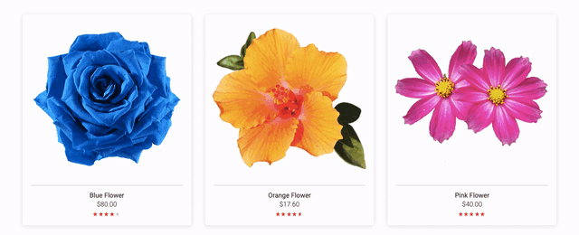

# FlowerShop
Simple example with Adonis serving json to a React app.



## Getting started
Download the repo and follow the steps below.

### Requirements
- Node.js 8.0 or greater
- Npm 3.0 or greater


### Install dependencies
- Install AdonisJs CLI:
```
npm i -g @adonisjs/cli
```

- Go to the `backend/` directory and run:
```
npm install
```

- Go to the `frontend/` directory and run:
```
npm install
```

### Create a database
Have your PostgreSQL server running and create a database.

### Env variables
- On the file `backend/.env.example`, do the following:
    - fill up `DB_DATABASE` with the database name you chose on the previous step
    - choose the port you wish the server to run. Default is `PORT=3333`
    - choose the port on which your database is running. Default for PostgreSQL is `DB_PORT=5432`
    - save it and rename the file to `.env`

- On the file `frontend/.env.example`, do the following:
    - fill up `REACT_APP_API_HOST` and `REACT_APP_API_PORT` with the `HOST` and `PORT` from `backend/.env`
    - save it and rename the file to `.env`


### Populate database
Go to the `backend/` directory and run:
```
adonis migration:run && adonis seed
```

### Run the dev servers
- Go to the `backend/` directory and run:
```
adonis serve --dev
```

- On another terminal, go to the `frontend/` directory and run:
```
npm start
```

The application will run on `http://localhost:3000`. 

> If you want to run on a different port, say 3001, add `PORT=3001` to the `frontend/.env` file.

## Api endpoints
The enpoints are listed [here](https://documenter.getpostman.com/view/7887094/SzKQyfao?version=latest).
